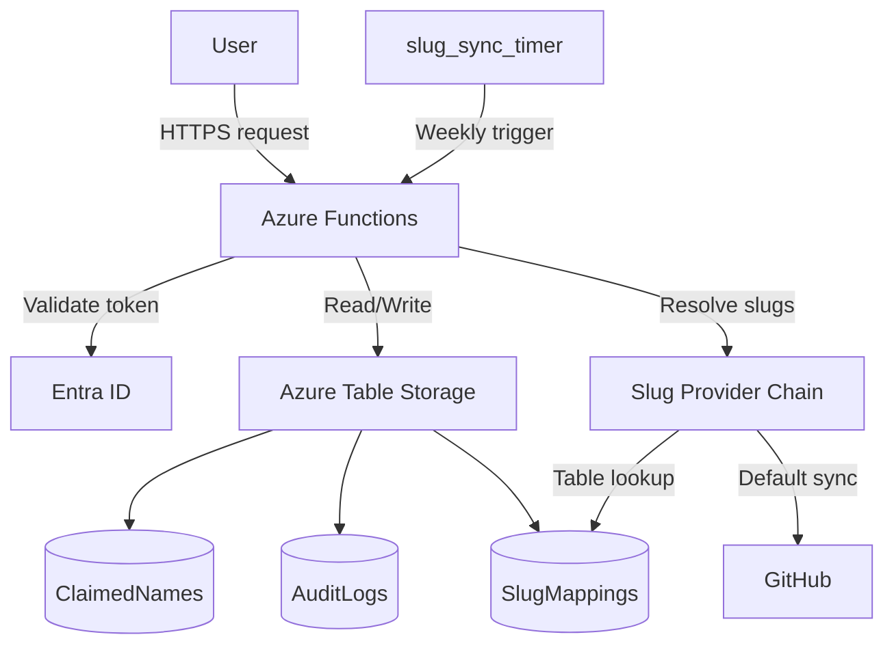

# 🧭 Azure Naming Function

[](https://github.com/gedefili/azure-naming/actions/workflows/ci.yml)
[](https://github.com/gedefili/azure-naming/releases)
[](https://github.com/gedefili/azure-naming/actions/workflows/integration.yml)

This project provides a secure, auditable, and standards-compliant Azure naming service. It uses Azure Functions, Table Storage, and Entra ID for identity and access control.

<!-- Architecture Diagram -->


---

## 📂 Folder Structure

| Folder             | Purpose                                                                 |
| ------------------ | ------------------------------------------------------------------------ |
| `function_app.py`  | Azure Functions v2 entry points (HTTP + Timer)                            |
| `core/`            | Domain services (name generation, slug service, user settings, validation) |
| `adapters/`        | Integrations for storage, slug fetching, audit logs, and release tooling   |
| `app/`             | HTTP routes, request/response models, dependency wiring                    |
| `docs/`            | Project documentation                                                     |

---

## 🧠 Features

* ✅ Slug-based, consistent naming generation
* 🔐 Role-based access control (Entra ID)
* 🧾 Audit logs and user history
* ♻️ Release + recycle name logic
* 🔁 Slug sync from Azure naming standards
* 🧩 Extensible provider model for naming rules and slug resolution

---

## 📄 Endpoints

* `POST /api/claim` — generate and reserve a name
* `GET  /api/slug?resource_type=` — resolve the slug for a resource type
* `POST /api/release` — release an existing name
* `GET  /api/audit?name=` — audit a single name
* `GET  /api/audit_bulk?...` — audit a user/project/time
* `POST /api/slug_sync` — manually refresh slugs (default provider updates Table Storage)
* `GET  /api/docs` — interactive Swagger UI for every endpoint
* `GET  /api/openapi.json` — machine-readable OpenAPI 3.0 document

Each endpoint requires an `Authorization: Bearer <token>` header issued by Entra ID.

### 🔑 App Roles

Assign one of the custom app roles to callers in Entra ID:

| Role | Permissions |
| ---- | ----------- |
| **Sanmar Naming Reader** | View OpenAPI docs and query audits for your own activity. |
| **Sanmar Naming Contributor** | Generate/release names and query audits. |
| **Sanmar Naming Admin** | Everything above plus slug sync and cross-user audits. |

Tokens are validated server-side; no function keys are required.

---

## 🚀 Deploying (Paused)

> Deployment to Azure is temporarily on hold while we focus on local workflows. Treat the checklist below as future-looking reference.

* Provision Azure Storage + Function App (see [docs/05-operations/deployment.md](docs/05-operations/deployment.md))
* Create Tables: `ClaimedNames`, `AuditLogs`, `SlugMappings`
* Register app in Entra, assign roles

---

## 📚 Documentation

**Complete documentation hub:** Start at **[docs/index.md](docs/index.md)** for a comprehensive index to all guides.

Quick navigation by topic:

| Topic | Location |
|-------|----------|
| **Getting Started** | [docs/02-getting-started/](docs/02-getting-started/) — App registration, auth setup |
| **API Reference** | [docs/03-api-reference/](docs/03-api-reference/) — Endpoint specs, data schemas |
| **Local Development** | [docs/04-development/](docs/04-development/) — Setup, testing, architecture |
| **Operations & Deployment** | [docs/05-operations/](docs/05-operations/) — Production deployment, security, cost |
| **Planning & Contributing** | [docs/01-planning/](docs/01-planning/) — Contributing guide, changelog |
| **Refactoring** | [docs/06-refactoring/](docs/06-refactoring/) — Code quality improvements (Phase 1 & 2 complete) |

**Documentation highlights:**
- 📖 **[API Endpoints](docs/03-api-reference/usage.md)** — Complete endpoint reference with examples
- 🛠️ **[Local Testing](docs/04-development/local-testing.md)** — How to run the service locally
- 🔐 **[Authentication Guide](docs/02-getting-started/auth.md)** — Understanding roles and token validation
- 📋 **[Deployment Checklist](docs/05-operations/deployment.md)** — Azure provisioning and configuration
- 🧩 **[Module Structure](docs/04-development/module-structure.md)** — Python package organization

The architecture diagram above is rendered from [docs/04-development/architecture.mmd](docs/04-development/architecture.mmd).

---

## ✅ Branch Protection

Require the `Integration tests` workflow before merging to `main`:

1. Navigate to **Settings → Branches**, edit (or create) the rule for `main`.
2. Enable **Require status checks to pass before merging**.
3. Select **Integration tests** (workflow file: `.github/workflows/integration.yml`).
4. Save the rule so that every merge validates the end-to-end suite.

---

## 🔌 Extensibility Overview

Both naming rules and slug resolution use a **pluggable provider architecture**. The default providers load rules from in-repo configuration and slugs from Azure Table Storage (populated by the scheduled sync). You can override either pipeline without changing the HTTP routes:

| Extension Point | Default Provider | How to Override |
| --------------- | ---------------- | --------------- |
| Naming rules    | Layered JSON definitions in `rules/*.json` loaded by `core.naming_rules` | Set `NAMING_RULE_PROVIDER` to a `module.callable` that returns an object with `get_rule(resource_type)` or call `core.naming_rules.set_rule_provider(...)` during startup. Override the rules directory with `NAMING_RULES_PATH=/path/to/dir` (legacy `NAMING_RULES_FILE` still supported). |
| Slugs           | `adapters.slug.TableSlugProvider` via `core.slug_service` | Set `SLUG_PROVIDER` to a `module.attr` that returns one or more providers implementing `get_slug(resource_type)` or call `core.slug_service.set_slug_providers([...])`. |

Providers are evaluated in order until one succeeds. This makes it straightforward to layer in custom data sources (for example, in-memory caches, REST lookups, or alternative storage) while keeping the rest of the system unchanged.

---

## 🔐 Bearer token (local testing)

Most endpoints require an Entra ID bearer token with one of the app roles (Reader, Contributor or Admin). For local testing you have several options:

- Azure CLI (quick):

```bash
az account get-access-token --resource api://<AZURE_CLIENT_ID> --query accessToken -o tsv
```

- Repository helper (prints token + claims):

```bash
python tools/get_access_token.py --show-claims --client-id "$AZURE_CLIENT_ID"
# Copy the token between the markers and export it for curl/Postman
export ACCESS_TOKEN="<PASTE_TOKEN_HERE>"
```

Using the token with Postman / Newman / curl

- Postman: set environment variable `auth_token` to the raw token value (the included collection reads `Authorization: Bearer {{auth_token}}`).
- Newman (CLI): inject the token into the included environment file before running:

```bash
jq --arg token "$ACCESS_TOKEN" '.values |= map(if .key=="auth_token" then .value=$token else . end)' tests/postman_environment.json > /tmp/env.json
npx newman run tests/postman_collection.json -e /tmp/env.json --insecure
```

GitHub Actions

- `postman.yml` supports a `bearer_token` workflow input when you manually dispatch the workflow; the workflow is input-only and does not read repository secrets. For CI runs that need authenticated Postman requests, provide the token as the `bearer_token` input when dispatching the workflow. Avoid storing long-lived tokens in repository secrets—prefer short-lived test tokens or run tests locally with the token helper.

Local integration helper

Use the helper to run integration tests locally and optionally perform an authenticated smoke test.

```bash
# Run integration tests (requires .venv with dependencies installed and Azurite running)
python3 tools/run_integration_locally.py

# Run integration tests and authenticated smoke test with explicit token
python3 tools/run_integration_locally.py --token "$ACCESS_TOKEN" --function-url "http://localhost:7071"

# Or have the helper invoke the token helper (requires az login and client id)
python3 tools/run_integration_locally.py --client-id "$AZURE_CLIENT_ID"
```


## Ownership & License

This repository is maintained by `gedefili` in partnership with Sanmar. The
code is owned by Sanmar and is published under the MIT License. Contributors
working on behalf of Sanmar should ensure their employer's contribution policy
permits the assignment of copyright under the MIT terms.

By default, this project accepts contributions under the MIT license; see
`LICENSE` for the full text.
