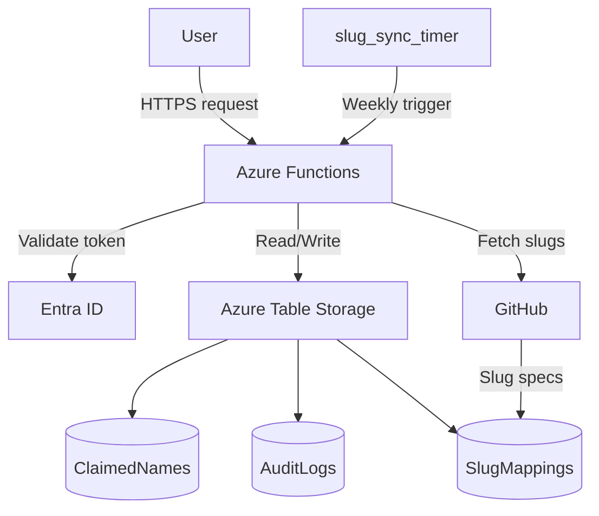

# 🧭 Azure Naming Function

This project provides a secure, auditable, and standards-compliant Azure naming service. It uses Azure Functions, Table Storage, and Entra ID for identity and access control.

<!-- Architecture Diagram -->

---

## 📂 Folder Structure

| Folder             | Purpose                                         |
| ------------------ | ----------------------------------------------- |
| `claim_name/`      | Claim name endpoint                             |
| `release_name/`    | Release a name                                  |
| `audit_name/`      | Audit single name history                       |
| `audit_bulk/`      | Audit by user, project, or time range           |
| `slug_sync/`       | Pull slugs from GitHub, sync to Table Storage   |
| `slug_sync_timer/` | Timer function for weekly slug updates          |
| `utils/`           | Shared modules (auth, slug fetcher, validation) |
| `docs/`            | Project documentation                           |

---

## 🧠 Features

* ✅ Slug-based, consistent naming generation
* 🔐 Role-based access control (Entra ID)
* 🧾 Audit logs and user history
* ♻️ Release + recycle name logic
* 🔁 Slug sync from Azure naming standards

---

## 📄 Endpoints

* `POST /api/claim` — generate and reserve a name
* `POST /api/release` — release an existing name
* `GET  /api/audit?name=` — audit a single name
* `GET  /api/audit_bulk?...` — audit a user/project/time
* `POST /api/slug_sync` — manually refresh slugs

Each endpoint requires an `Authorization: Bearer <token>` header issued by Entra ID.

---

## 🚀 Deploying

* Provision Azure Storage + Function App (see [deployment.md](docs/deployment.md))
* Create Tables: `ClaimedNames`, `AuditLogs`, `SlugMappings`
* Register app in Entra, assign roles

---

## 📚 Documentation

* [📘 Usage](docs/usage.md)
* [🔐 Authentication & RBAC](docs/auth.md)
* [🗃 Schemas & Naming Rules](docs/schema.md)
* [🚀 Deployment Guide](docs/deployment.md)
* [🧪 Local Development & Postman Testing](docs/local-testing.md)
