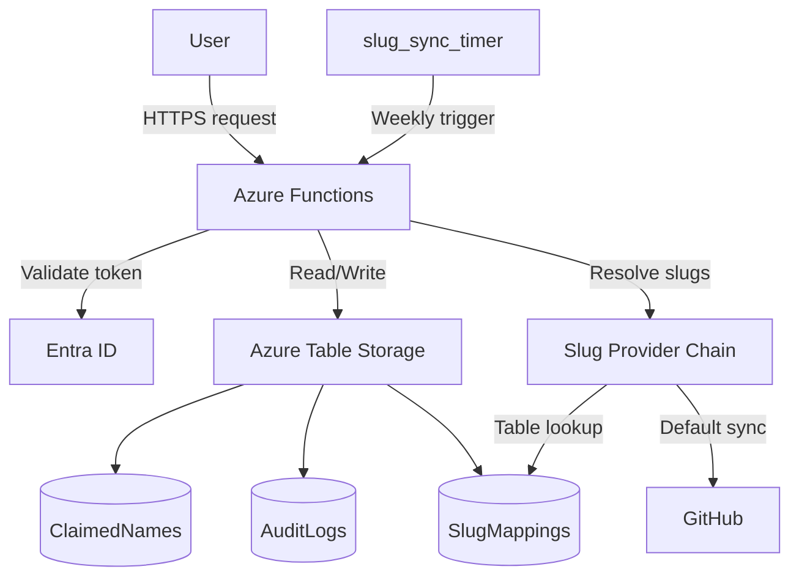

# 🧭 Azure Naming Function

This project provides a secure, auditable, and standards-compliant Azure naming service. It uses Azure Functions, Table Storage, and Entra ID for identity and access control.

<!-- Architecture Diagram -->

---

## 📂 Folder Structure

| Folder             | Purpose                                                                 |
| ------------------ | ------------------------------------------------------------------------ |
| `function_app.py`  | Azure Functions v2 entry points (HTTP + Timer)                            |
| `core/`            | Domain services (name generation, slug service, user settings, validation) |
| `adapters/`        | Integrations for storage, slug fetching, audit logs, and release tooling   |
| `app/`             | HTTP routes, request/response models, dependency wiring                    |
| `docs/`            | Project documentation                                                     |

---

## 🧠 Features

* ✅ Slug-based, consistent naming generation
* 🔐 Role-based access control (Entra ID)
* 🧾 Audit logs and user history
* ♻️ Release + recycle name logic
* 🔁 Slug sync from Azure naming standards
* 🧩 Extensible provider model for naming rules and slug resolution

---

## 📄 Endpoints

* `POST /api/claim` — generate and reserve a name
* `POST /api/generate` — legacy alias for claim
* `POST /api/release` — release an existing name
* `GET  /api/audit?name=` — audit a single name
* `GET  /api/audit_bulk?...` — audit a user/project/time
* `POST /api/slug_sync` — manually refresh slugs (default provider updates Table Storage)
* `GET  /api/docs` — interactive Swagger UI for every endpoint
* `GET  /api/openapi.json` — machine-readable OpenAPI 3.0 document

Each endpoint requires an `Authorization: Bearer <token>` header issued by Entra ID.

### 🔑 App Roles

Assign one of the custom app roles to callers in Entra ID:

| Role | Permissions |
| ---- | ----------- |
| **Sanmar Naming Reader** | View OpenAPI docs and query audits for your own activity. |
| **Sanmar Naming Contributor** | Generate/release names and query audits. |
| **Sanmar Naming Admin** | Everything above plus slug sync and cross-user audits. |

Tokens are validated server-side; no function keys are required.

---

## 🚀 Deploying

* Provision Azure Storage + Function App (see [deployment.md](docs/deployment.md))
* Create Tables: `ClaimedNames`, `AuditLogs`, `SlugMappings`
* Register app in Entra, assign roles

---

## 📚 Documentation

* [📘 Usage](docs/usage.md)
* [🔐 Authentication & RBAC](docs/auth.md)
* [🗃 Schemas, Naming Rules & Providers](docs/schema.md)
* [🚀 Deployment Guide](docs/deployment.md)
* [🧪 Local Development, Swagger & Postman](docs/local-testing.md)
* [💰 10-Year Cost Estimate](docs/cost-estimate.md)

---

## 🔌 Extensibility Overview

Both naming rules and slug resolution use a **pluggable provider architecture**. The default providers load rules from in-repo configuration and slugs from Azure Table Storage (populated by the scheduled sync). You can override either pipeline without changing the HTTP routes:

| Extension Point | Default Provider | How to Override |
| --------------- | ---------------- | --------------- |
| Naming rules    | `core.naming_rules.DEFAULT_RULE` and `RESOURCE_RULES` | Set `NAMING_RULE_PROVIDER` to a `module.callable` that returns an object with `get_rule(resource_type)` or call `core.naming_rules.set_rule_provider(...)` during startup. |
| Slugs           | `adapters.slug.TableSlugProvider` via `core.slug_service` | Set `SLUG_PROVIDER` to a `module.attr` that returns one or more providers implementing `get_slug(resource_type)` or call `core.slug_service.set_slug_providers([...])`. |

Providers are evaluated in order until one succeeds. This makes it straightforward to layer in custom data sources (for example, in-memory caches, REST lookups, or alternative storage) while keeping the rest of the system unchanged.
